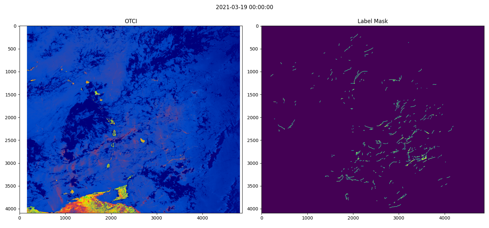

This project is an educational exemple of an image detection task solved using pytorch, pytorch_lightning and mfai.

You can find the followind educational ressources to guide you through the different facets of this project:
- [pytorch lightning guide](./doc/pytorch_lightning.md)
- [mfai](./doc/mfai.md)

## Sargasses

The goal of this project is to detect Sargassum shoals on Sentinel 3 satellite images, using Deep Learning.

## Installation

### Using micromamba

This procedure has been tested on a EWC ECMWF developement machine with A100 GPU.

Micromamba install :
```bash
 "${SHELL}" <(curl -L micro.mamba.pm/install.sh)
```

Micromamba source and update :
```bash
 source ~/.bashrc
 micromamba self-update
 ```

Activate a dedicated environment for the project :
```bash
micromamba create -p /scratch/dev/sarg
micromamba activate /scratch/dev/sarg
```

Install python 3.11 and the requirements
```bash
micromamba install python=3.11.*
pip install --index-url https://download.pytorch.org/whl/cu124 torchvision==0.21.0+cu12 torch==2.6.0+cu12
pip install -r requirements.txt
```


## Dataset

After annotating your OTCI images:
    * Put your json file with your annotations is in the **LABELS_PATH**
    * Put all the png files (OTCI) is in the **OTCI_PATH**
    * Put all the netcdf files (SEN3) is in the **NETCDF_PATH**

1. Generate masks of algae labels: 
    * `runai python bin/preprocessing/1_labels2imgs.py`

2. Pre-compute crops position on full images and save them as NPY on disk: it is a bit long to compute so we do it on a GPU node with 40 CPUs.
    * `runai gpu_play 4`
    * `runai python bin/preprocessing/2_create_crops.py`

3. Visualize data samples (on priam): `runai python_mpl sargasses/data.py`

Example of input image and label for one full satellite image:



## Training

From priam-sidev:

1. `runai build`

2. `runai push`

3. `runai gpu_play`

4. `runai pull`

5. `runai python_gpu bin/fit_and_val.py --config <your/config/file.yaml>`

See [config documentation](config/configs.md) for more details on how to read and create config files.

## Inference

1. If you have the algae mask for a specific date (on gpu or not):
```bash
runai python_gpu bin/predict.py --ckpt_path <path/to/checkpoit.ckpt> -i /path/to/your/algae/mask.npz -o <output/path.png>
```

2. If you only have the raw netcdf (on gpu or not) please run:
```bash
runai python_gpu bin/evaluate/2_predict_tests_samples.py --ckpt_dir /path/to/your/model --nc_dir /path/to/your/raw/netcdf
```

To compute prediction over all tests samples (sent by T. Guinaldo, stored in `/scratch/shared/sargasses/tests/netcdf/`):
```bash
runai python_gpu bin/evaluate/2_predict_tests_samples.py --ckpt_dir /path/to/your/model
```